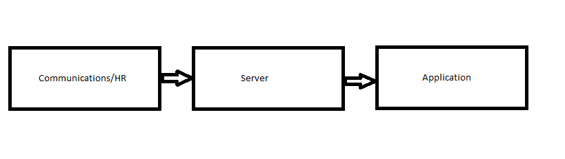

Communicator
============

Internal tool for BBD staff communication

##Base Notification##

Base notification is the basic notification that will be used to send messages to the employees on the proposed mobile application. This type of notification uses a push technology. That is, it will use an internet-based communication which is initiated by the publisher(or a central server). The proposed attributes for the base notification are:

- Message
- Image
- Subject

**Message** - The message contains the actual text of the notification. For example if the base notification is a birthday message the the message might be:
> ''happy birthday XXXXX'' 

**Image** - The image is the image of the notification. For example, if the notification is a birthday message then the image might be an image of a cake.

**Subject** - This attribute will contain the subject of the message/notification that is being sent. For example the Communications or HR team will choose from the following Subject options: 

- Birthday
- Awards
- Invitations/Events
- Newborns

**Base Notification Flow Diagram** - 

