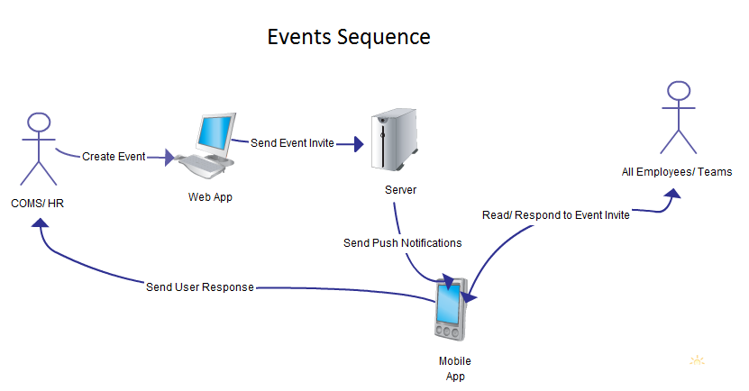

Communicator
============
Internal tool for BBD staff communication
<<<<<<< HEAD
 
 

#######Awards 

1.A communication employee logs into the webApp and sends
a reminder that will be sent to all the employees informing them to nominate each other (base notification). 

2.The application will display a list of employees name, surname and their picture.

3.From that list,an employee will be able to select who they want to nominate.

4.Once they have nominated an employee a text box will appear enabling them to comment on why they have nominated the individual.

5.An email will be sent to the communications team with every person nominated. 

6.The communications team will send a message to the all the employees showing the people with the highest nominations (base notification). 

7.A notification will be sent to all the employee showing all the winners (base notification).

process flows for the nominations/awards

Step 1 

Step 2 

    
=======
##Web application####

####Overview of login function:###

Users will be logged in using the Yammer OAuth API.

####Overview of events function:####
Sends a base message which may include: 

- Subject
- Message
- Image

In addition, questions that require user feedback need to be added.
These questions are:

 -  RSVP
 -  Dietary requirements
 -  Number of guests
 -  Driver required

Users will give feedback to any of the questions listed above from within the app.
	
Events may be sent to all employees or just to specific teams.
	
	
	

##Base Notification##
Base notification is the basic notification that will be used to send messages to the employees on the proposed mobile application. This type of notification uses a push technology. That is, it will use an internet-based communication which is initiated by the publisher(or a central server). The proposed attributes for the base notification are: image, subject and message.

**Message** - The message contains the actual text of the notification. For example if the base notification is a birthday message the the message might be:
> ''happy birthday XXXXX'' 

**Image** - The image is the image of the notification. For example, if the notification is a birthday message then the image might be an image of a cake.

##Event Invites##
 

#######Awards 

1.A communication employee logs into the webApp and sends
a reminder that will be sent to all the employees informing them to nominate each other (base notification). 
 
2.The application will display a list of employees name, surname and their picture.

3.From that list,an employee will be able to select who they want to nominate.

4.Once they have nominated an employee a text box will appear enabling them to comment on why they have nominated the individual.

5.An email will be sent to the communications team with every person nominated. 

6.The communications team will send a message to the all the employees showing the people with the highest nominations (base notification). 

7.A notification will be sent to all the employee showing all the winners (base notification)..

process flow

>>>>>>> upstream/master
